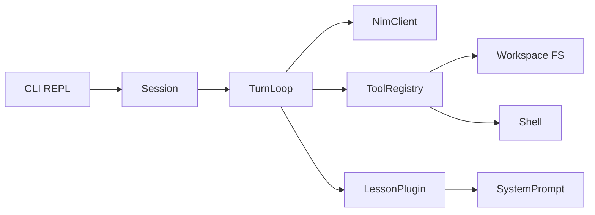

# Day 0: Educational Coding Harness Skeleton

## Intent

Build the **smallest runnable harness** that demonstrates turn-based coding assistance under free NIM constraints. Lessons are plugins; the harness is the teaching object. No full agent product, no real lesson content beyond a stub plugin.

**Locked decisions**
- Language: TypeScript / Node
- Scope: docs + thin skeleton (runnable, not production-capable)
- Models: NVIDIA NIM via OpenAI-compatible API (`https://integrate.api.nvidia.com/v1`)

## Architecture (what students will learn)



One turn = user message → model call (with tools) → tool execution → model continues or yields reply. That loop is the whole product.

## Project layout

Single package (no monorepo yet) to stay light:

```
harness-ide-prototype/
  package.json
  tsconfig.json
  README.md                 # how to run + what this teaches
  docs/
    ARCHITECTURE.md         # day-0 source of truth
    TURN_LOOP.md            # one turn, step by step
    LESSON_PLUGINS.md       # how curriculum plugs in
    NIM_CONSTRAINTS.md      # free-tier realities that shape design
  src/
    cli.ts                  # entry: Claude Code–like REPL
    session.ts              # conversation + workspace root
    turn-loop.ts            # the educational core
    model/
      types.ts
      nim-client.ts         # OpenAI-compat stub (real HTTP, thin)
      mock-client.ts        # offline stub for classroom demos
    tools/
      types.ts              # ToolDefinition / ToolResult
      registry.ts
      read-file.ts
      write-file.ts
      edit-file.ts
      bash.ts               # guarded; cwd = workspace
    lessons/
      types.ts              # LessonPlugin contract
      registry.ts
      stub-bfs.ts           # minimal example plugin (metadata + prompt only)
    prompt/
      build-system-prompt.ts
  .env.example              # NVIDIA_API_KEY, NIM_MODEL
```

## Core contracts (keep tiny)

**Tool** — name, description, JSON-schema params, `execute(args, ctx) → ToolResult`. Day 0 ships four tools only: `read_file`, `write_file`, `edit_file`, `bash`.

**LessonPlugin** — `id`, `title`, `topics[]`, `systemPromptAddon`, optional `starterFiles`, optional `evaluate` stub. Core never hardcodes Dijkstra/BFS; it loads plugins from a registry. Day 0 includes one stub lesson (`stub-bfs`) that only contributes prompt text + a tiny starter file map — no grader yet.

**ModelClient** — `chat({ messages, tools }) → assistant message | tool_calls`. `NimClient` wraps `openai` SDK pointed at NIM; `MockClient` returns scripted turns so the loop is demoable without a key.

## NIM as a design constraint (documented, not fought)

[`docs/NIM_CONSTRAINTS.md`](docs/NIM_CONSTRAINTS.md) will state explicitly:
- OpenAI Chat Completions at `integrate.api.nvidia.com/v1`
- Free-tier rate/credit limits → small prompts, few tools, short histories
- Tool-calling quality varies by model → harness must degrade gracefully (text-only fallback stub)
- Default model configurable via `NIM_MODEL` (e.g. a coding-capable catalog id); no vendor lock-in beyond the client adapter

The turn loop stays **stateless between turns except message history**, with a hard message-window trim so free models do not drown in context.

## CLI shape (familiar, not a clone)

[`src/cli.ts`](src/cli.ts): readline REPL in a workspace directory.
- Banner + current lesson id
- `>` prompt for user turns
- Slash commands only: `/lesson`, `/tools`, `/clear`, `/help`, `/quit`
- Print tool calls/results in a readable Claude Code–ish trace (name + short args + result summary)
- No TUI framework yet (ink/blessed later if needed)

## Docs as curriculum (day 0 priority)

Write these first, then implement to match:

1. **ARCHITECTURE.md** — modules, data flow, what is *not* in scope
2. **TURN_LOOP.md** — annotated walkthrough of one turn (maps 1:1 to `turn-loop.ts`)
3. **LESSON_PLUGINS.md** — plugin interface + how a future Dijkstra lesson would plug in without touching the loop
4. **NIM_CONSTRAINTS.md** — why the harness is small
5. **README.md** — install, `npm run start`, mock vs NIM mode

Every `src/` module gets a 3–6 line file header pointing to the matching doc section. The harness teaches by being readable.

## Day-0 acceptance criteria

- `npm install && npm run start` runs the REPL (mock model by default)
- With `NVIDIA_API_KEY` set, `--model nim` hits the real endpoint (smoke path; may fail on tool_calls depending on model — documented)
- Student can open `docs/ARCHITECTURE.md` + `src/turn-loop.ts` and see the same story
- Adding a new lesson = new file under `src/lessons/` + registry entry; no core edits
- No graders, no IDE UI, no persistence, no multi-agent, no rich TUI

## Out of scope (explicit)

Full Claude Code parity, streaming UX polish, auth, lesson content library, automated assessment, web UI, monorepo packaging, production hardening.

## Implementation order

1. Scaffold package (`package.json`, `tsconfig`, scripts: `start`, `typecheck`)
2. Write the four docs + README (architecture first)
3. Types + mock model + turn loop
4. Four tools + registry
5. Lesson contract + `stub-bfs`
6. NIM client + env wiring
7. CLI REPL wiring end-to-end
