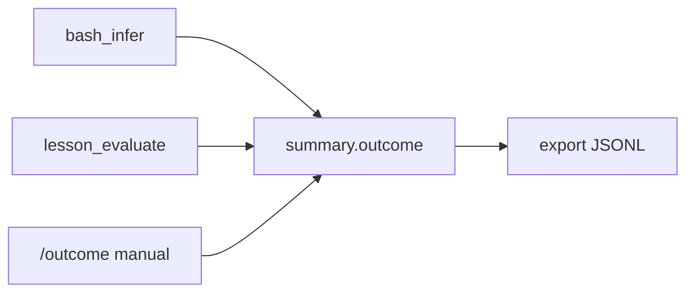

# Session export and outcome labeling

## Goal

Turn `.hey-teach/sessions/` from “resume chat” into a **labeled trajectory store** suitable for later SFT/QLoRA: each session gets an outcome, and `/export` writes one JSONL line per session with messages + metadata.

## Data model

Extend [`SessionSummary`](src/session-store.ts):

```ts
outcome?: "unlabeled" | "green" | "red" | "abandoned" | "error"
outcomeSource?: "manual" | "bash_infer" | "lesson_evaluate"
outcomeNote?: string
outcomeAt?: string  // ISO
teacherModel?: string  // e.g. NIM_MODEL or "mock" at session open
```

Default for new sessions: `outcome: "unlabeled"`. Persist via existing atomic `summary.json` writes; add `SessionStore.patchSummary(partial)` so CLI/evaluate don’t rewrite message counts incorrectly.

Record `teacherModel` once when opening a session in [`src/cli.ts`](src/cli.ts) (`mock` or `process.env.NIM_MODEL`).

## Outcome labeling (three inputs, one field)



1. **`bash_infer` (automatic, best-effort)**  
   After each successful `bash` tool result in [`turn-loop.ts`](src/turn-loop.ts), if output looks like a test run (vitest/jest/`npm test` / `exit_code` + “Tests”), parse:
   - all passed → suggest/update `green` (only if current is `unlabeled` or `red`)
   - failures/assertions → `red`  
   Do **not** overwrite `manual` or `abandoned`.

2. **`lesson_evaluate`**  
   Wire the existing stub on [`LessonPlugin.evaluate`](src/lessons/types.ts):
   - CLI: `/evaluate` runs `lesson.evaluate({ workspaceRoot })` and writes `outcome` + `outcomeSource: "lesson_evaluate"`.
   - Implement for [`stub-bfs`](src/lessons/stub-bfs.ts): run `npx vitest run lessons/bfs/graph.test.ts` (cwd workspace), map exit 0 → `green`, else `red`, feedback from stderr/stdout snippet.

3. **Manual**  
   `/outcome green|red|abandoned|error|unlabeled [note…]` on the active session. Source `manual` always wins until user changes it again.

`/sessions` listing gains a short outcome column (`green` / `red` / `-`).

## Export format (concrete)

**One JSON object per session, JSONL file** (OpenAI-style messages — matches stored shape; easy to map to ShareGPT later):

```json
{
  "id": "2026-07-20T19-11-57-8fe293",
  "lessonId": "stub-bfs",
  "outcome": "red",
  "outcomeSource": "bash_infer",
  "teacherModel": "mistralai/mistral-medium-3.5-128b",
  "exportedAt": "...",
  "messageCount": 29,
  "messages": [ /* role/content/tool_calls — system-reminder blocks stripped from tool content */ ]
}
```

- Default output: `.hey-teach/exports/<iso-stamp>.jsonl` (already gitignored via `.hey-teach/`).
- Filters: `/export` (active session only), `/export all`, `/export green` (outcome filter).
- Also `npm run export` → thin `src/export-cli.ts` calling the same module (non-interactive, `--all`, `--outcome green`, `--out path`).

Implementation module: [`src/export/trajectories.ts`](src/export/trajectories.ts) — load summaries + messages, strip `<system-reminder>…</system-reminder>` from tool contents (train the *behavior*, not the crutch), write JSONL.

## CLI surface ([`src/cli.ts`](src/cli.ts))

| Command | Behavior |
|---------|----------|
| `/outcome <label> [note]` | Set manual outcome on active session |
| `/evaluate` | Run lesson grader; update outcome |
| `/export [all\|green\|red\|…]` | Write trajectories JSONL; print path + counts |
| `/sessions` | Show outcome beside each id |

## Docs (curriculum)

- New [`docs/EXPORT.md`](docs/EXPORT.md): why capture → label → export; schema; how this feeds SFT/QLoRA later (pointer to weights story, no training code yet).
- Update [`docs/SESSIONS.md`](docs/SESSIONS.md), [`README.md`](README.md), [`docs/ARCHITECTURE.md`](docs/ARCHITECTURE.md) module map.
- Note in [`docs/LESSON_PLUGINS.md`](docs/LESSON_PLUGINS.md) that `evaluate` is now called from `/evaluate`.

## Out of scope (this slice)

- Actual LoRA/QLoRA training scripts or GGUF conversion
- DPO pair mining
- Cloud upload
- Compaction / rewriting noisy traces

## Acceptance

- After a session with failing `npm test`, summary can show `outcome: red` via infer or `/evaluate`.
- `/outcome abandoned` persists and is not clobbered by later bash_infer.
- `/export all` writes JSONL; each line parses; tool messages have no `system-reminder` blocks.
- `npm run export -- --all` works headlessly.
- Docs explain the flywheel in student-facing language.
