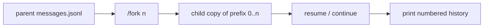

# Session trees, fork, and visible history

## Goal

Sessions stay a JSONL log + `summary.json` ([SESSIONS.md](docs/SESSIONS.md), [issue #1](https://github.com/anomit/hey-teach/issues/1)). A conversation can **branch** at a message index while the parent log is left alone. Resume must **show the thread**, not only “resumed (N messages)” — today the store reloads history for the model, but the CLI never reprints it, so `/fork n` would be guesswork.



## Gap this slice also fixes: resume is silent

[`openSessionStore`](src/session-store.ts) already loads `messages.jsonl` into [`Session`](src/session.ts). The banner in [`src/cli.ts`](src/cli.ts) only notes `resumed (N messages)`. No `/history` command exists. A student who `--session <id>` or hits the default “continue most recent” path sees an empty prompt.

That is both a UX bug and a prerequisite for trees: **index `n` has to be visible**.

## History printer

New small helper (e.g. [`src/cli/history.ts`](src/cli/history.ts)) — keep [`src/cli.ts`](src/cli.ts) from growing another wall of formatters.

**When it runs**

- After the banner whenever `resumed === true` and `messages.length > 0` (default continue, `--session <id>`).
- `/history` on demand (same printer). Needed mid-session to pick a fork point.

**Format (compact, numbered, 0-based — matches JSONL / `forkedAtIndex`)**

```
  0  user       implement bfs in graph.ts
  1  assistant  tool_calls: read_file
  2  tool       read_file  ok  35 lines
  3  assistant  I’ll add a queue and a visited set…
```

Rules:

- Index = line order in `messages.jsonl` (same as `session.messages[i]`).
- `user` / `assistant` content: first ~120 chars, single line.
- `assistant` with `tool_calls`: list names, not the full args JSON.
- `tool`: name + ok/err + short summary (reuse the spirit of `printTrace` in [`src/cli.ts`](src/cli.ts)). Do **not** dump full diffs or test output on resume.
- After the list: `N messages. /fork [n] branches from an index; omit n for HEAD.`

Empty session: `/history` prints `No messages yet.` Resume with 0 messages stays silent (fresh `/new`).

## Data model

Extend [`SessionSummary`](src/session-store.ts):

```ts
parentId?: string;
forkedAtIndex?: number; // inclusive end of copied prefix; 0-based
```

No new files. Parent log is never truncated. Child is a **copy** of lines `0..n`, then appends as usual.

[`SessionStore.fork(fromIndex)`](src/session-store.ts):

1. `loadMessages()` from the parent.
2. Snap `n` (see below); reject if empty / out of range with a clear error.
3. `createSessionId()`, `init()` the child (same `lessonId`, `teacherModel`; **outcome `unlabeled`** — do not inherit parent green/red).
4. Write the prefix into the child’s `messages.jsonl`; set `messageCount`, `parentId`, `forkedAtIndex`.
5. Return the new store + messages. Parent directory untouched.

**Snap rule:** if `n` lands on an `assistant` that has `tool_calls` with no following `tool` results, or on a `tool` whose sibling results are incomplete, snap **back** to the last message that leaves a valid OpenAI prefix (typically the last `user` or final `assistant` text). Print `snapped n → n'` so the index is not magic.

`/fork` with no `n` = HEAD (after snap). That is “bookmark here and keep going on a child,” unlike `/new` (empty sibling) or `/clear` (wipe same id).

**`/fork` switches the REPL to the child.** Otherwise the command is only a snapshot.

Workspace files are **not** copied. Print one line: the child’s transcript is a prefix; the disk is still the parent’s latest tree. Snapshotting the workspace is a different persistence problem.

## CLI surface ([`src/cli.ts`](src/cli.ts))

| Command | Behavior |
|---------|----------|
| `/history` | Print numbered compact thread (same as resume replay) |
| `/fork [n]` | Copy prefix through `n` (or HEAD); switch active session to child |
| `/sessions` | **Tree**: roots (no `parentId`), indented children; keep `*` and outcome column |

`/sessions` sort: roots by `updatedAt` desc (active work first); siblings by `createdAt` so the tree is stable. “Continue most recent” stays latest `updatedAt` across all ids — a just-forked child wins, which is what you want.

`/clear` stays an in-place wipe of the current id. Do not call it rewind. `SESSIONS.md` already lists rewind checkpoints as not-yet; this slice does not add in-place truncate.

## `/sessions` tree (sketch)

```
* 2026-08-26T13-01-00-aaa  green      msgs=24  lesson=stub-bfs
  └ 2026-08-26T13-40-00-bbb  unlabeled  msgs=12  lesson=stub-bfs  fork@7
  2026-08-26T12-00-00-ccc  red        msgs=8   lesson=stub-bfs
```

Indent with `└` / spaces; one level is enough for v1 if we also handle deeper children (indent +2 per depth). Cycles cannot occur if we only write `parentId` on create.

## Export

[`TrajectoryRecord`](src/export/trajectories.ts) gains optional `parentId` and `forkedAtIndex`. One JSONL line per session id, as today. Siblings that share a prefix and diverge are useful later (contrastive pairs); this slice does not mine DPO pairs.

## Turn loop (intentionally unchanged)

[`trimMessages`](src/turn-loop.ts) still keeps the **last** `MAX_MESSAGES`. Issue #1’s “prefix-stable so a branch can reuse a cached prompt prefix” is the reason trees exist, but changing the window to a prefix policy is a follow-up. This slice copies prefixes on disk; the loop may still slide. Note that tension in `SESSIONS.md`.

## Docs (curriculum)

- [`docs/SESSIONS.md`](docs/SESSIONS.md): fork fields, `/fork` / `/history`, resume reprints the thread, workspace is not forked, rewind ≠ `/clear`.
- [`docs/EXPORT.md`](docs/EXPORT.md): lineage fields on each trajectory line.
- [`README.md`](README.md) slash table + resume sentence.
- [`docs/ARCHITECTURE.md`](docs/ARCHITECTURE.md): session module still JSONL; trees are summary fields, not a new store.

## Out of scope (this slice)

- In-place truncate billed as rewind
- Compaction / summarization
- Changing `trimMessages` to a prefix-stable window
- Workspace / git snapshots on fork
- TUI, extra tools, extra model clients
- DPO pair mining from sibling branches

## Acceptance

- Resume (default or `--session <id>`) with a non-empty log prints numbered history after the banner; the model still sees the full stored thread.
- `/history` reprints that list; indices match `messages.jsonl`.
- `/fork 7` creates a new id whose JSONL is parent lines `0..7` (after snap); parent file bytes unchanged; REPL prompt is the child.
- `/fork` with no args copies through HEAD.
- `/sessions` shows parent → children, `*` on the active id, outcome column unchanged.
- Child `summary.outcome` is `unlabeled`; `/export` lines include `parentId` / `forkedAtIndex` when set.
- Docs state that disk files are not rolled back on fork.
